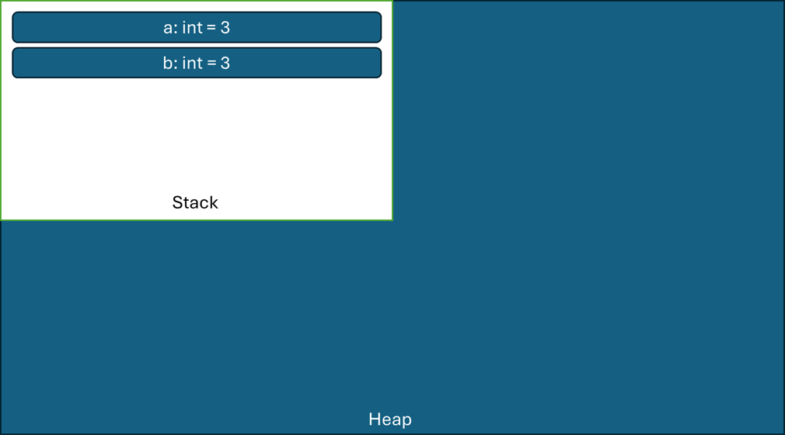
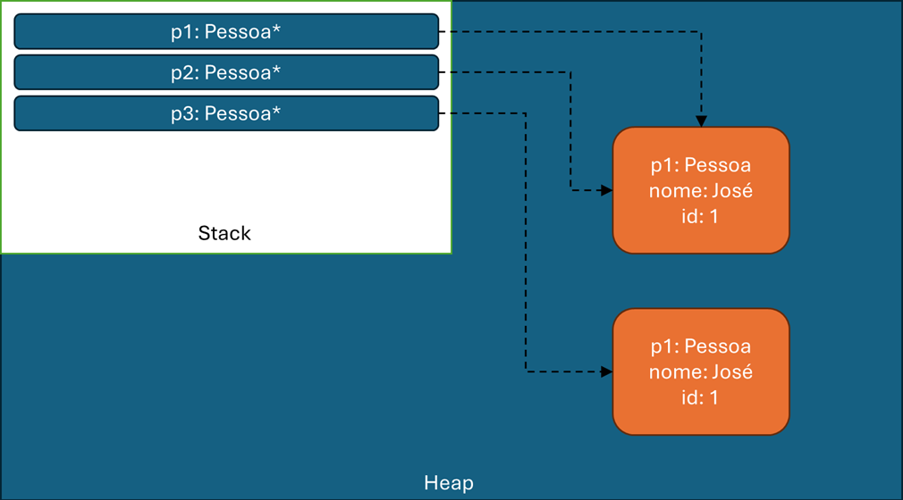

# Java Estrutura de dados

O objetivo deste projeto é entender o funcionamento e implementação básica das estruturas de dados mais elementares: os vetores, as listas, as filas e as pilhas. Além disso, através do entendimento do funcionamento interno destas estruturas, nos tornaremos aptos a julgar de maneira correta quando cada uma destas estruturas deve ser utilizada.

## Change log
2. Gerenciamento de memória pela JVM
  - Aula 2.3 - Value Types e Reference Types
  - Aula 2.4 - Stack e Heap
  
  - Aula 2.5 - Ponteiros e os métodos equals() e hashCode()
    
  - Desafio de código 2.1

3. Vetores
  - Aula 3.4 - Conceitos básicos
  - Aula 3.5 - Encapsulando as funcionalidades de um vetor
  - Aula 3.6 - Criando estruturas genéricas
  - Aula 3.7 - Restrições na utilização de Generics
    O uso de generics não permite o uso de tipos primitivos, por isso, seus Wrappers correspondentes devem utilizados
    | Primitivo | Wrapper |
    | - | - |
    | boolean | Boolean |
    | char | Character |
    | double | Double |
    | int | Integer |
    | long | Long |
  - Aula 3.8 - Criando a funcionalidade de inserção
  - Aula 3.9 - Criando a funcionalidade de inserir em uma posição específica
  - Aula 3.10 - Iterando sob um vetor
  - Aula 3.11 - Adicionando as funcionalidades contem() e indice()
